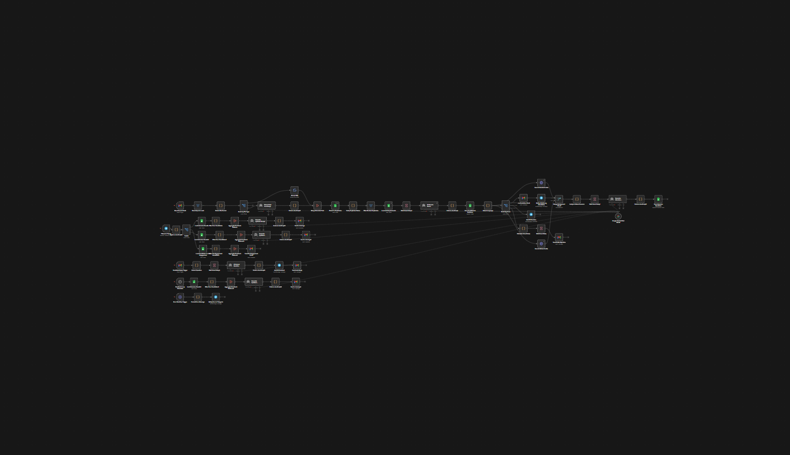

# 👻 Ghost-Recruiter: AI-Powered Autonomous Resume Screening

> **Architecting the future of recruitment: From 8 hours of manual grind to 15 minutes of strategic decision-making.**

Ghost-Recruiter is a production-grade automation system built to solve the "Resume Black Hole" problem. It doesn't just filter candidates; it uses advanced LLM reasoning to understand context, intent, and professional depth.

---

## 🛠 Tech Stack & Core Systems

| Component | Technology | Role |
| :--- | :--- | :--- |
| **Orchestrator** | [n8n](https://n8n.io/) | Logic, API handling, and error recovery paths. |
| **Digital Brain** | [Google Gemini](https://deepmind.google/technologies/gemini/) | Contextual analysis and semantic scoring. |
| **Database** | [Supabase](https://supabase.com/) | Structured storage, candidate logs, and idempotency control. |
| **Security** | PII Protection | Ensuring personal data is handled according to best practices. |

---

## 🏗 System Architecture (The "Architect" Approach)

Unlike basic automation scripts, Ghost-Recruiter is built with **Systems Thinking**:

1. **Ingestion Layer:** Resumes are received via Webhooks or IMAP (Email) triggers.
2. **Pre-processing:** PDF/Docx data is parsed and cleaned using JavaScript nodes.
3. **Reasoning Layer:** Gemini analyzes the candidate's journey. It looks for *growth*, *impact*, and *skill application* rather than simple keyword matches.
4. **Scoring Engine:** A weighted "Match Score" is generated based on job descriptions.
5. **Human-in-the-Loop:** High-score candidates are pushed to a Telegram/Slack notification channel for final human approval.

---

## 🚀 Key Features

* **Idempotency:** The system checks for existing records in Supabase to prevent duplicate processing.
* **Retry Logic:** Built-in error handling ensures that if an API call fails, the workflow retries before alerting.
* **Structured Logs:** Every action is logged in Supabase for full auditability.
* **Scalability:** Can process 1 or 1,000 resumes without increasing human workload.

---

## 📊 Business Impact

| Metric | Manual Process | Ghost-Recruiter |
| :--- | :--- | :--- |
| **Time (500 resumes)** | ~8 Hours | **~15 Minutes** |
| **Evaluation Depth** | Surface/Keywords | **Deep Contextual** |
| **Cost per Hire** | High (Human hours) | **Low (API calls)** |
| **Consistency** | Low (Fatigue) | **100% Consistent** |

---

## ⚙️ Setup & Deployment

### 1. Prerequisites
* Self-hosted or Cloud **n8n** instance.
* **Google Gemini API** key (Vertex AI or AI Studio).
* **Supabase** project (PostgreSQL).

### 2. Installation
1. Clone this repository.
2. Import the `Ghost-Recruiter_Workflow.json` into your n8n instance.
3. Set your credentials for Gemini and Supabase.
4. Update the "Environment Variables" node with your specific job criteria.

---

## 💎 Special Launch Offer
To celebrate our Product Hunt launch, you can get the full **Ghost-Recruiter Pro** template with a massive discount. 

Use coupon code: **LAUNCH20** at checkout to get **35% OFF!**

[👉 Get Ghost-Recruiter Pro on Gumroad](https://naroka.gumroad.com/l/Ghost-Recruiter-AI-Resume-Screening)

## 🤝 Connect & Collaborate

**David Ignatenko** *AI & Automation Architect | M.Arch*

- **LinkedIn:** [linkedin.com/in/david-ignatenko-3775a6408](https://www.linkedin.com/in/david-ignatenko-3775a6408)
- **Product Hunt:** [Ghost-Recruiter on PH](https://naroka.gumroad.com/l/Ghost-Recruiter-AI-Resume-Screening)
- **Gumroad:** [Store](https://naroka.gumroad.com)
  

---

## 🤝 Join the Affiliate Program
Want to earn by sharing **Ghost-Recruiter**? I offer a generous **50/50 commission split** for every successful referral. 

**How it works:**
1. Sign up as an affiliate via [Gumroad/your-platform].
2. Share your unique link with your network (LinkedIn, Twitter, YouTube).
3. Earn **50% of every sale** made through your link. https://naroka.gumroad.com/affiliates

Help businesses automate their hiring and get rewarded for it! 🚀
© 2026 David Ignatenko. Built with passion for efficiency.
